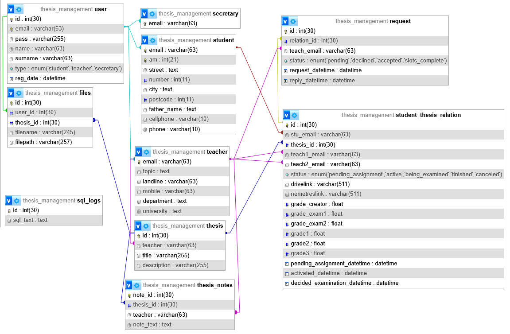

# Programming in the World Wide Web Project
This project was made for the undergraduate elective course Programming and Systems for the World Wide Web (CEID1092). The goal of this project was to implement a website that would manage the assignment and review process for the students' thesis.
The [project](https://eclass.upatras.gr/modules/document/file.php/CEID1092/%CE%95%CF%81%CE%B3%CE%B1%CF%83%CF%84%CE%B7%CF%81%CE%B9%CE%B1%CE%BA%CE%AE%20%CE%86%CF%83%CE%BA%CE%B7%CF%83%CE%B7%202024%20-%202025/Ergastiriaki_Askisi_24-25-1.0.pdf).

# Setup 
The project is writen in PHP version 8.2.12 with MariaDB version 10.4.32 from XAMPP version 3.3.0. The project relies on a database which can be added manually with the code in the [database_code.txt file](.github/include/database_code.txt), or a ready made database can be imported with the [thesis_management.sql file](.github/include/thesis_management.sql).

# The Database

This is the diagram for the database. All users extend the table user and they belond in one of three categories: student, teacher, or secretary. According to their role they also occupy a position in that respective table in which they get some extra information.

# Usage
The website should open via index.php in which you can create new users by filling the respective forms, or log in using the user's credentials. If you log in as a secretary you will have the option to import a .json file filled with users. Such a .json file is provided [here](.github/include/db-export.php.json) sourced from [this page](http://usidas.ceid.upatras.gr/web/2024/index.php).

## Flow
The flow of the site goes as follows. First a teacher user must create a thesis which will be added to the thesis table in the database. Then they may select any of the thesis subject that they have created and assign it to a student. This creates an entry in the student_thesis_relation table and sets the thesis as "pending_assignment". Then the student can request any teacher that hasn't already gotten a request to be a part of this thesis. The teachers recieve the student requests and they may accept or deny them. Once a thesis subject has two unique examiners the status of the thesis automatically changes to "active". In the "active" state the student should upload relevant files that all the teachers that are part of that thesis can review. Any teacher may add a note to that thesis. Following that a teacher can set the thesis as "being_examined". In that state the teachers may score the student based on their performance on a scale from 0 to 20. Once all three scores have been set the secretary can set the thesis as "finished". Any teacher or secretary can cancel the thesis. A student can be assigned any number of thesis as long as only one is active at a time (the others are canceled). A teacher may participate in any number of thesis.

# Project Results
The project was graded with a 7/10.

# Shortcomings
- A couple of the questions were not completed. Namely the date-time in which the student was due to present their thesis.
- The range for grading thesis should be from 0 to 10.
- The project is writen in exclusively php. It would've been more efficient to use javascript to mitigate the reliance on reloading the pages.